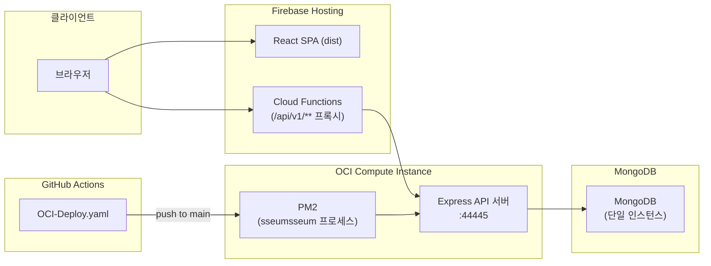

# 💰 씀씀(sseumsseum) - 개인 금융 관리 서비스 백엔드 API

개인의 수입/지출 내역을 관리하고, 예산·카테고리 기반의 대시보드/리포트를 제공하는 **Node.js(Express) 기반 RESTful API 서버**입니다.

이 문서는 애플리케이션 기능보다 **배포/운영 구조**에 초점을 맞춰 정리했습니다. (백엔드 개발 관점의 상세 기능/API 설명은 [기능 개요](#기능-개요), [API 개요](#api-개요) 섹션 참고)

---

## 목차

1. [인프라 & 배포 아키텍처](#인프라--배포-아키텍처)
2. [CI/CD 파이프라인](#cicd-파이프라인)
3. [프로세스 관리 (PM2)](#프로세스-관리-pm2)
4. [기술 스택](#기술-스택)
5. [기능 개요](#기능-개요)
6. [프로젝트 구조](#프로젝트-구조)
7. [데이터 모델](#데이터-모델)
8. [개발 환경 설정](#개발-환경-설정)
9. [API 개요](#api-개요)
10. [운영 관점에서의 회고 / 한계](#운영-관점에서의-회고--한계)
11. [보안 관련 안내](#보안-관련-안내)

---

## 인프라 & 배포 아키텍처



- **프론트엔드**: Firebase Hosting에 정적 파일(React SPA)을 배포. `/api/v1/**` 요청은 Firebase Cloud Functions를 통해 백엔드로 라우팅.
- **백엔드**: OCI(Oracle Cloud Infrastructure) Compute Instance 위에서 Node.js(Express) 프로세스를 PM2로 상시 구동.
- **데이터베이스**: 별도 관리형 DB 서비스 없이 MongoDB를 단일 인스턴스로 운영 (복제/샤딩 없음).
- **배포 자동화**: `main` 브랜치 push 시 GitHub Actions가 SSH로 OCI 인스턴스에 접속해 코드 반영 및 프로세스 재시작.

> ⚠️ 현재 OCI 인스턴스는 프로젝트 종료 후 회수되어 운영되지 않습니다. 위 구조는 실제 운영 당시 구성을 기준으로 정리한 것입니다.

---

## CI/CD 파이프라인

`.github/workflows/OCI-Deploy.yaml` 기준, `main` 브랜치에 push되면 다음 단계로 배포가 진행됩니다.

1. **트리거**: `main` 브랜치 push (`AccountBookCICD` 리포지토리 한정으로 조건 분기)
2. **Checkout**: `actions/checkout@v3`로 소스 체크아웃
3. **원격 배포 (`appleboy/ssh-action`)**: GitHub Secrets(`OCI_HOST_IP`, `OCI_USERNAME`, `SSH_PRIVATE_KEY`)로 OCI 인스턴스에 SSH 접속 후 아래 스크립트 실행
   ```bash
   cd /home/ubuntu/AccountBookCICD

   # nvm으로 Node 22 버전 고정
   export NVM_DIR="$HOME/.nvm"
   [ -s "$NVM_DIR/nvm.sh" ] && . "$NVM_DIR/nvm.sh"
   nvm use 22

   git pull origin main
   npm install

   # PM2 프로세스 재시작
   npm restart
   ```

**설계 포인트**
- 배포 서버 접근 정보(호스트/계정/SSH 키)를 GitHub Secrets로 분리해 워크플로우 파일에 노출하지 않음.
- `nvm use 22`로 배포 서버의 Node.js 버전을 명시적으로 고정해, 로컬/CI/운영 간 런타임 버전 불일치를 방지.
- `if: github.repository == 'BJZJZJZJ/AccountBookCICD'`로 fork된 저장소에서 실수로 워크플로우가 실행되는 것을 방지.

**개선 여지 (알고 있는 한계)**
- 빌드 산출물 검증(테스트, 린트)이 파이프라인에 없어 `git pull` 이후 바로 배포됨 → 배포 전 검증 단계 부재.
- SSH 기반의 단일 인스턴스 직접 배포 방식이라, 배포 중 짧은 다운타임이 발생할 수 있음 (무중단 배포 아님).
- 롤백 전략이 없어, 배포 후 장애 시 이전 커밋으로 수동 되돌리기가 필요함.

---

## 프로세스 관리 (PM2)

`ecosystem.config.js` 기준 프로세스 설정:

```js
module.exports = {
  apps: [
    {
      name: "sseumsseum",
      script: "server.js",
      instances: 1,
      autorestart: true,
      env: { NODE_ENV: "production" },
    },
  ],
};
```

- **인스턴스 수 1개**로 운영되어 프로세스 크래시 시 PM2가 자동 재시작하지만, 클러스터 모드(다중 인스턴스)나 로드밸런싱은 적용되어 있지 않음.
- `npm start` / `npm stop` / `npm restart` 스크립트로 PM2 명령을 래핑해서 사용 (`package.json` 참고).

| 스크립트 | 내용 |
| --- | --- |
| `npm run dev` | 로컬 개발 실행 (`NODE_ENV=development node server.js`) |
| `npm run dev:prod` | 프로덕션 환경 변수로 로컬 실행 |
| `npm start` | `pm2 start ecosystem.config.js --env production` |
| `npm stop` | `pm2 stop sseumsseum` |
| `npm restart` | `pm2 restart sseumsseum` |

---

## 기술 스택

| 분류 | 기술 |
| --- | --- |
| 런타임/프레임워크 | Node.js, Express 5 |
| 데이터베이스 | MongoDB (Mongoose) |
| 인증 | JSON Web Token (jsonwebtoken), bcryptjs |
| 프로세스 관리 | PM2 |
| CI/CD | GitHub Actions (`appleboy/ssh-action`) |
| 호스팅 | OCI Compute Instance (백엔드), Firebase Hosting/Functions (프론트엔드) |
| 문서화 | swagger-jsdoc, swagger-ui-express |
| 요청 제한/보안 | express-rate-limit, express-basic-auth, cors, cookie-parser |

---

## 기능 개요

애플리케이션 도메인 기능은 다음과 같습니다. (상세 API 명세는 [API 개요](#api-개요) 참고)

- **인증/계정**: JWT(Access/Refresh) 인증, 이메일 인증, 비밀번호 변경/회원 탈퇴
- **거래 내역**: 수입/지출 CRUD, 필터링·페이지네이션, CSV 일괄 업로드
- **카테고리**: 대분류-소분류 계층 구조
- **예산**: 월별 예산 설정 및 지출 대비 리포트
- **대시보드/리포트**: MongoDB Aggregation(`$lookup`, `$group`, `$facet`)을 활용한 통계 집계

---

## 프로젝트 구조

```
sseumsseum/
├── server.js                  # 앱 진입점
├── ecosystem.config.js        # PM2 배포 설정
├── .github/workflows/
│   └── OCI-Deploy.yaml        # CI/CD 파이프라인
├── src/
│   ├── config/                # 환경 변수, DB 연결, Swagger 설정
│   ├── controllers/           # 라우트별 비즈니스 로직
│   ├── models/                # Mongoose 스키마
│   ├── routes/                # 라우터 (Swagger 명세 포함)
│   ├── middleware/             # 인증, Basic Auth, Rate Limit, Validator
│   ├── data/                  # 정적 데이터 (거래 키워드 매핑)
│   └── utils/                 # jwt, password, mailer, multer, csv 파싱
├── uploads/insertDefaultCategory.js  # 기본 카테고리 시드 스크립트
└── public/template.csv               # 거래내역 업로드 템플릿
```

---

## 데이터 모델

| 모델 | 주요 필드 | 설명 |
| --- | --- | --- |
| **User** | email, password_hash, role, nickname, birth, gender, verified | 사용자 계정. `role`은 `user`/`admin` |
| **Category** | name, type, isDefault, parentCategory | `parentCategory`로 대분류-소분류 계층 구현 |
| **UserCategory** | userId, categoryId | 사용자가 선택/사용 중인 카테고리 매핑 |
| **Transaction** | userId, categoryId, amount, method, type, description, transactionDate | 개별 거래 내역 |
| **Budget** | userId, month, categories[{categoryId, amount}] | 월 단위 카테고리별 예산 |
| **RefreshToken** | userId, token, expiresAt, isActive | 리프레시 토큰 관리 |
| **VerificationToken** | - | 이메일 인증용 토큰 |

---

## 개발 환경 설정

```bash
git clone https://github.com/BJZJZJZJ/sseumsseum
cd sseumsseum
npm install
```

`NODE_ENV` 값에 따라 `.env.development` 또는 `.env.production` 파일을 프로젝트 루트에 생성합니다. (`src/config/index.js`가 `../../.env.${NODE_ENV}` 경로를 읽음)

```env
# CORS
CORS_ALLOWED_ORIGIN="http://localhost:3000"

# 서버
SERVER_URL="http://localhost:44445"
PORT="44445"

# MongoDB
DATABASE_URL="mongodb://<user>:<password>@<host>:27017/<db>?authSource=admin"

# JWT
JWT_ACCESS_EXPIRY="15m"
JWT_REFRESH_EXPIRY="15d"
JWT_ACCESS_TOKEN_SECRET=<access token secret>
JWT_REFRESH_TOKEN_SECRET=<refresh token secret>
JWT_PASSWORD_TOKEN_SECRET=<password token secret>

# 이메일 (SMTP)
SMTP_HOST=<smtp host>
SMTP_PORT=<smtp port>
SMTP_USER=<smtp user>
SMTP_PASS=<smtp password>
EMAIL_FROM="No-Reply <no-reply@yourdomain.com>"
TOKEN_EXPIRES_MIN=30

# API 문서 보호용 Basic Auth
AUTH_USER=<api docs user>
AUTH_PASSWORD=<api docs password>
```

```bash
npm run dev        # 개발 모드
npm run dev:prod    # 프로덕션 환경 변수로 로컬 실행
npm start           # PM2로 프로덕션 실행
```

---

## API 개요

서버 실행 후 `http://localhost:{PORT}/api-docs`에서 Swagger 문서를 확인할 수 있습니다 (Basic Auth로 보호). 모든 API는 `/api/v1` 하위 경로를 기준으로 합니다.

| 리소스 | Base Path | 주요 엔드포인트 |
| --- | --- | --- |
| 인증 | `/api/v1/auth` | `POST /register`, `POST /login`, `POST /logout`, `POST /refresh`, `POST /resend`, `GET /verify` |
| 사용자 | `/api/v1/users` | `GET /me`, `PUT /me`, `POST /me/password`, `PUT /me/password`, `DELETE /me` |
| 카테고리 | `/api/v1/categories` | `GET /`, `GET /default/parent`, `GET /default/child`, `POST /`, `DELETE /:id` |
| 거래 내역 | `/api/v1/transactions` | `GET /`, `POST /`, `PUT /:id`, `DELETE /:id`, `POST /upload`, `GET /template` |
| 예산 | `/api/v1/budgets` | `GET /`, `POST /`, `PUT /:id`, `DELETE /:id`, `GET /report` |
| 대시보드 | `/api/v1/dashboard` | `GET /` |
| 리포트 | `/api/v1/reports` | `GET /`, `GET /top-spending`, `GET /category-detail` |

---

## 운영 관점에서의 회고 / 한계

실제로 인프라를 구성/운영해본 경험을 바탕으로, 이 프로젝트에서 아쉬웠던 지점을 정리했습니다.

- **컨테이너화 미적용**: Docker 이미지가 없어 배포 서버(OCI)에 Node.js/nvm을 직접 설치하고 의존하는 구조. 환경 재현성이 낮고, 서버를 새로 구성할 때마다 수동 설정이 필요했음.
- **단일 인스턴스 구조**: 애플리케이션 서버·MongoDB 모두 단일 인스턴스로 운영되어 장애/트래픽 증가에 대한 여유가 없음. 무중단 배포, 오토스케일링, DB 이중화 등이 적용되지 않음.
- **모니터링/로깅 부재**: PM2 기본 로그 외에 별도의 중앙 로깅이나 알림(예: 헬스체크 실패 알림) 체계가 없어, 장애를 사후에 인지하는 구조였음.
- **배포 파이프라인에 검증 단계 부재**: 테스트/린트 없이 `git pull` 즉시 배포되는 구조라, 배포 전 자동 검증이 없었음.
- **인프라를 코드로 관리하지 않음(No IaC)**: OCI 인스턴스 설정을 수동으로 구성해, 설정 변경 이력 추적이나 재현이 어려웠음.

> 이후 다시 다룬다면 Docker 기반 컨테이너화, GitHub Actions에 테스트 단계 추가, 헬스체크 기반 모니터링 도입을 우선순위로 개선하고 싶습니다.

---

## 보안 관련 안내

`.env.development`, `.env.production` 파일은 `.gitignore`에 포함되어 Git 저장소에는 커밋되지 않았습니다. 이 README의 환경 변수 예시는 실제 값이 아닌 placeholder입니다.
